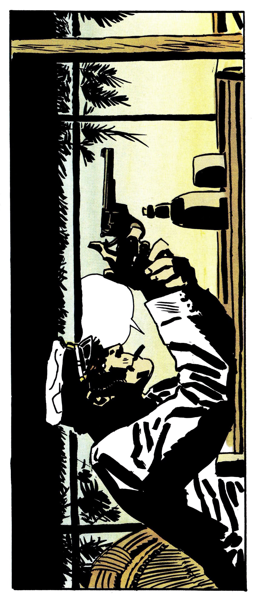

<p align="center">
  
</p>

# GravityGuyML — RL + Gymnasium + Pygame

## Overview

_(Placeholder — to be completed.)_

---

## What is the game?

A fast side-scroller inspired by _Gravity Guy_. The world scrolls left while two platform lanes (top & bottom) carry static or moving segments. You control a runner who can **flip gravity** between lanes. **Spikes** are mounted on platforms (pointing inward), and touching them (or going out of bounds) ends the run. The aim is simple: **survive as long as possible** by flipping at the right times.

### Core mechanics

- **Flip** between lanes (top/bottom) to avoid gaps and spikes.
- **Moving platforms** oscillate vertically; you can ride them if you stay grounded.
- **Instant death** on spike contact; **out-of-bounds** also ends the run.
- Deterministic level generation per **seed** (useful for reproducible tests & RL).

### Controls

- `SPACE` – flip gravity (only while alive)
- `ESC` – quit
- When dead:
  - `R` – restart with the **same** seed
  - `N` – restart with a **new random** seed
- Mouse left-click on the on-screen button also restarts after death

---

## RL “aerial” goal (high level)

Train agents (e.g., DQN) that **outperform random and tiny heuristics** by learning when to flip to avoid spikes and gaps. We use a **Gymnasium** environment (obs v2: 15-dim features) for training and evaluation on held-out seeds. The same seeds + action sequences allow exact **replay** for debugging.

---

## Run the game (from repo root)

> Use `src` (lowercase) unless your codebase actually uses `Source/`.

```bash
# Typical
python -m src.game.game

# Reproduce a specific level
python -m src.game.game --seed 123

# Force a new random seed on launch
python -m src.game.game --seed -1
```

If you see `ModuleNotFoundError: src...`, make sure you’re running from the **repo root** (the folder that contains `src/`).

---

## Repository layout (placeholder)

_(We’ll fill this once all parts are finalized: env, observations v2, sanity rollouts, replay, DQN training & eval.)_

### Repo layout

- `src/game/` — core game (config, level, player, game loop)
- `src/env/` — Gymnasium env (`GGEnv v2`), observations v2
- `experiments/runs/` — outputs (episodes, traces, DQN runs)
- `experiments/notebooks/` — analysis notebooks
- `experiments/replay.py` — visual episode replay
- `src/eval/sanity_rollouts.py` — random & heuristic rollouts

---

## Setup

- Python version, venv, install requirements
- How to run a quick smoke test

---

## Quickstart

- Play the game (optional)
- Run sanity rollouts (random + heuristic)
- Replay a recorded episode

### Commands

```bash
# Sanity rollouts (writes experiments/runs/episodes.csv and traces/)
python -m src.eval.sanity_rollouts --policies both --save-traces

# By policy
python -m src.eval.sanity_rollouts --policies random --out-dir experiments/runs --save-traces
python -m src.eval.sanity_rollouts --policies heuristic --out-dir experiments/runs --save-traces

# Replay (from repo root)
python -m experiments.replay --policy heuristic --seed 105
python -m experiments.replay --policy random --seed 112

# Or explicit file
python -m experiments.replay --trace experiments/runs/traces/heuristic/105_actions.npy --frame-skip 4
```

---

## Notebooks

- **Sanity (Random vs Heuristic)**: what it shows (distance, episode length, death causes, grounded ratio).
- **DQN**: training plan and evaluation.

When running notebooks from `experiments/notebooks/`, add the repo root to `sys.path`:

```python
from pathlib import Path, PurePath
import sys
here = Path.cwd().resolve()
for parent in [here, *here.parents]:
    if (parent / "src").exists():
        sys.path.insert(0, str(parent)); break
```

---

## Environment (Gymnasium)

- Env name/contract: obs (15-dim), actions {NOOP, FLIP}, `frame_skip=4`, \~15 Hz decisions, 30s limit.
- Reward outline (alive reward + terminal penalty, if any).
- Determinism: seed + action sequence ⇒ exact replay.

---

## Observations v2 (what the 15 features mean)

- `y, vy, g` + 3 probe blocks at +120/+240/+360: `(ceil_norm, floor_norm, spike_top, spike_bot)`.

---

## DQN (planned/used)

- Architecture: MLP 256×256 ReLU → 2 Q-values
- Loss: Huber; γ=0.99; Adam lr=1e-3; grad clip=10
- Replay: 100k; batch 256; train_every=4; target_update=1000
- ε-greedy: 1.0 → 0.05 over 100k decisions
- Eval: held-out seeds 101–120; logs under `experiments/runs/dqn/<run_id>/eval/`

---

## Outputs & logging

- `experiments/runs/episodes.csv` — sanity rollouts summary
- `experiments/runs/traces/<policy>/<seed>_actions.npy` — replayable actions
- `experiments/runs/dqn/<run_id>/` — config, metrics, eval summaries, traces, checkpoints

---

## Reproducibility

- Seed policy (env seed, action RNG seeds), deterministic replay
- How to reproduce a figure from a specific run

---

## Known issues / FAQ

- Common import path fix (adding repo root to `sys.path`)
- Pygame “video system not initialized” ⇒ call `env.render()` once before polling events
